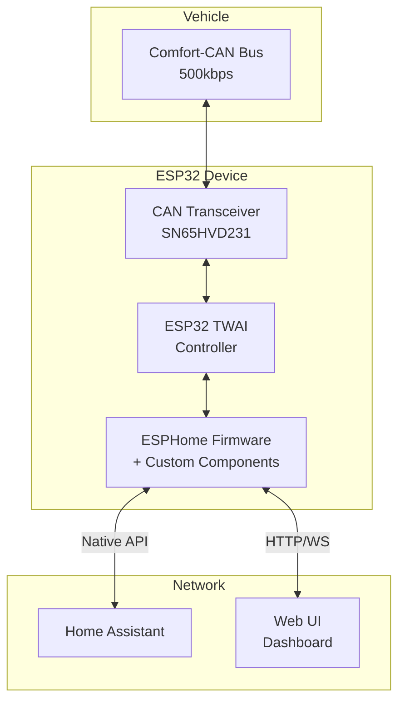

# VW T6.1 CAN Scanner - Technical Architecture

## 1. Overview

The VW T6.1 CAN Scanner is an **ESP32-based ESPHome device** that monitors the vehicle's Comfort-CAN bus, providing real-time data to Home Assistant with optional guarded control capabilities.

**Project Type:** Embedded IoT Device  
**Framework:** ESPHome 2024.12.0  
**Target Platform:** ESP32 (LILYGO T-CAN485)  
**Integration:** Home Assistant via Native API

## 2. System Architecture

### 2.1 High-Level Design



### 2.2 Core Components

| Component | Responsibility | Technology |
|-----------|---------------|------------|
| **CAN Capture** | Hardware interface, ISR handling | C++ / ESP-IDF TWAI |
| **Ring Buffer** | Lock-free frame queuing | C++ atomics |
| **Dispatcher** | Frame routing and filtering | C++ / ESPHome events |
| **Storage** | Log rotation and export | LittleFS |
| **Decoder** | CAN → HA entity mapping | YAML rules + C++ |
| **Web Server** | Live monitoring UI | ESPHome web_server |
| **HA Bridge** | Entity registration and control | ESPHome API |
| **TX Guard** | Safety gate for transmission | State machine |

## 3. Technology Stack

| Layer | Technology | Version | Purpose |
|-------|------------|---------|---------|
| **Hardware** | LILYGO T-CAN485 | v1.2 | ESP32 + CAN transceiver |
| **Framework** | ESPHome | 2024.12.0 | Runtime and HA integration |
| **Language** | C++17 / YAML | - | Components / Configuration |
| **Storage** | LittleFS | 2.5.0 | Flash filesystem |
| **Protocol** | Native API / WebSocket | - | HA / Web UI communication |

## 4. Data Flow

### 4.1 Capture Pipeline
```
CAN Bus → ISR (Core 0) → Ring Buffer → Dispatcher (Core 1) → [Storage, Decoder, WebSocket]
```

### 4.2 Control Path (Guarded)
```
HA Command → TX Guard Check → Whitelist Validation → CAN TX → Feedback Loop
```

## 5. Key Design Decisions

### 5.1 Safety First
- **Default Mode:** LISTEN_ONLY prevents any bus interference
- **TX Guard:** Explicit arming required for any transmission
- **Whitelist:** Only validated CAN IDs allowed for control

### 5.2 Performance
- **Dual Core Usage:** ISR on Core 0, application on Core 1
- **Ring Buffer:** Handles 2000+ frames/second without loss
- **Selective Updates:** Change detection prevents unnecessary HA traffic

### 5.3 Integration
- **ESPHome Native:** Uses built-in `esp32_can` component
- **Pure YAML Config:** No custom C++ components needed
- **Lambda Functions:** All logic handled in YAML lambdas

## 6. Project Structure

```
t6_canbus_esphome/
├── README.md                     # Project overview
├── docs/
│   ├── architecture.md           # This document
│   ├── can_id_sources.md         # How to find CAN IDs
│   └── wiring_guide.md           # Hardware installation
├── esphome/
│   ├── t6_can_scanner.yaml       # Main ESPHome config (pure YAML!)
│   └── secrets.yaml              # WiFi/API keys (gitignored)
├── decoder_rules/
│   └── vw_t6_comfort.yaml        # Example CAN ID mappings
└── hardware/
    └── wiring_guide.md            # Hardware connection guide
```

## 7. ESPHome Configuration

### 7.1 Core Configuration
```yaml
esphome:
  name: t6-can-scanner
  platform: ESP32
  board: esp32dev

# Built-in CAN bus component
canbus:
  - platform: esp32_can
    id: can_bus
    tx_pin: GPIO27
    rx_pin: GPIO26
    bit_rate: 500kbps
    
    on_frame:
    - can_id: 0x3B0  # Interior lighting
      then:
        - lambda: |-
            // Decode brightness from byte 3
            float brightness = x[3] * 100.0 / 255.0;
            id(interior_brightness).publish_state(brightness);

api:
  encryption:
    key: !secret api_encryption_key
```

### 7.2 Template Sensors (Updated by Lambdas)
```yaml
sensor:
  - platform: template
    name: "Interior Brightness"
    id: interior_brightness
    unit_of_measurement: "%"
    accuracy_decimals: 0
    
  - platform: template
    name: "Fridge Temperature"
    id: fridge_temp_actual
    unit_of_measurement: "°C"
    device_class: temperature
```

## 8. Decoder Rules Format

```yaml
rules:
  - name: interior_lights
    can_id: 0x3B0
    entities:
      - type: light
        name: "Camper LED"
        byte: 3
        bit_mask: 0xFF
        scale: 0.392  # 0-255 → 0-100%
```

## 9. Error Handling

### 9.1 CAN Bus Errors
- **Error Passive:** Disable TX, continue RX
- **Bus-Off:** Auto-recovery with exponential backoff
- **Buffer Overflow:** Count drops, maintain operation

### 9.2 Network Errors
- **WiFi Loss:** Buffer locally, reconnect automatically
- **HA Disconnect:** Queue entity updates, retry connection

## 10. Security Considerations

- **Network:** WPA2, local-only access, no cloud dependencies
- **CAN Safety:** Read-only default, physical wiring protection
- **Control:** Multi-layer validation (TX arm + whitelist + rate limit)
- **Updates:** OTA with password protection

## 11. Performance Targets

| Metric | Target | Actual |
|--------|--------|--------|
| Frame Rate | 2000 fps | TBD |
| ISR Latency | <10 μs | TBD |
| Web UI Latency | <60 ms | TBD |
| HA Update Latency | <100 ms | TBD |
| Flash Wear | 10k cycles | Managed |

## 12. Development Workflow

### 12.1 Setup
```bash
# Install ESPHome
pip install esphome

# Compile and upload
esphome run esphome/t6_can_scanner.yaml
```

### 12.2 Testing
1. Bench test with CAN simulator
2. Vehicle test in LISTEN_ONLY mode
3. Validate decoded entities in HA
4. Enable control features after validation

### 12.3 Debugging
- Serial monitor: `esphome logs t6_can_scanner.yaml`
- Web UI: `http://t6-can.local`
- PCAP export for Wireshark analysis

## 13. Deployment

### 13.1 Installation
1. Flash firmware via USB (initial)
2. Configure WiFi and HA API key
3. Install in vehicle footwell
4. Connect to gateway CAN pins
5. Verify in Home Assistant

### 13.2 Updates
- OTA via ESPHome Dashboard
- Version tags in GitHub releases
- Backup decoder rules before update

## 14. Community Integration

### 14.1 Decoder Rules
- Submit validated rules via GitHub PR
- Test with provided tools/rule_validator.py
- Document CAN ID purpose and scaling

### 14.2 Contributing
- Follow ESPHome component guidelines
- Include test data for new features
- Update documentation for API changes

## 15. References

- [ESPHome External Components](https://esphome.io/custom/custom_component.html)
- [ESP32 TWAI Documentation](https://docs.espressif.com/projects/esp-idf/en/latest/esp32/api-reference/peripherals/twai.html)
- [VW T6.1 PRD](./prd.md)

---

**Document Version:** 1.0  
**Last Updated:** 2025-08-28  
**Status:** Implementation Ready